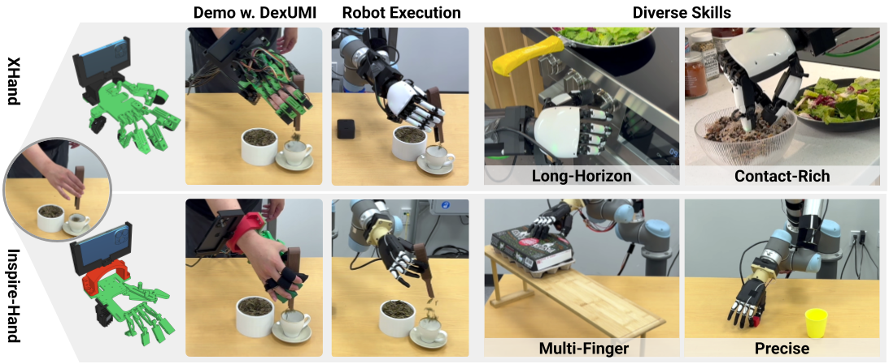

<h1 align="center" style="font-size: 3em;">Universal Manipulation Interface for<br>Dexterous Manipulation</h1>

[[Project page]](https://dex-umi.github.io)
[[Paper]](https://arxiv.org/pdf/2409.03403)
[[Hardware Guide]](https://dex-umi.github.io/tutorial/hardware.html)
[[Deployment Guide]](https://dex-umi.github.io/tutorial/hardware.html)



[Mengda Xu](https://mengdaxu.github.io/)<sup>\*,1,2,3</sup>,
[Han Zhang](https://doublehan07.github.io/)<sup>\*,1</sup>,
[Yifan Hou](https://yifan-hou.github.io/)<sup>1</sup>,
[Zhenjia Xu](https://www.zhenjiaxu.com/)<sup>5</sup>,
[Linxi Fan](https://jimfan.me/)<sup>5</sup>,
[Manuela Veloso](https://www.cs.cmu.edu/~mmv/)<sup>3,4</sup>,
[Shuran Song](https://shurans.github.io/)<sup>1,2</sup>

<sup>1</sup>Stanford University,
<sup>2</sup>Columbia University,
<sup>3</sup>J.P. Morgan AI Research,
<sup>4</sup>Carnegie Mellon University,
<sup>5</sup>NVIDIA

<sup>\*</sup>Indicates Equal Contribution
## 🚀 Installation

Tested on Ubuntu 22.04. 
We recommend Miniforge for faster installation:

```bash
cd DexUMI
mamba env create -f environment.yml
mamba activate dexumi 
```

DexUMI utilizes [SAM2](https://github.com/facebookresearch/sam2) and [ProPainter](https://github.com/sczhou/ProPainter) to track and remove the exoskeleton and hand. Our system uses [Record3D](https://github.com/marek-simonik/record3d) to track the wrist pose. To make Record3D compatible with Python 3.10, please follow the instructions [here](https://github.com/marek-simonik/record3d/issues/89). Alternatively, you can directly install our [forked version](https://github.com/mengdaxu/record3d), which already integrates the solution. Please clone the above three packages into the same directory as DexUMI. The final folder structure should be:

```bash
.
├── DexUMI
├── sam2
├── ProPainter
├── record3D
```

Download the SAM2 checkpoint `sam2.1_hiera_large.pt` into `sam2/checkpoints/`. 

You also need to install Record3D on your iPhone. We use iPhone 15 Pro Max to track the wrist pose. You can use any iPhone model with ARKit capability, but you might need to modify some CAD models to adapt to other iPhone dimensions.

## 🦾 Real-world Deployment

### 🛠️ Build Exoskeleton 

Please check our hardware guide to download the CAD model and assembly tutorial for both Inspire Hand and XHand exoskeletons.
<table>
<tr>
<td align="center">
  <h4>XHand Exoskeleton</h4>
  
</td>
<td align="center">
  <h4>Inspire Hand Exoskeleton</h4>
  
</td>
</tr>
</table>


### 📷 Data Recording and Processing

Please check the data recording and processing tutorial before data collection. 

Record data with the exoskeletons:
```bash
python DexUMI/real_script/data_collection/record_exoskeleton.py -et -ef --fps 45 --reference-dir /path/to/reference_folder --hand_type xhand/inspire --data-dir /path/to/data
```

If you do not have a force sensor installed, simply omit the `-ef` flag.

The data will be stored in `/path/to/data`. Each episode structure should be:
```bash
└── episode_0
   ├── camera_0
   ├── camera_0.mp4
   ├── camera_1
   ├── camera_1.mp4
   ├── numeric_0
   ├── numeric_1
   ├── numeric_2
   └── numeric_3
```

After collecting the dataset, modify the following parameters in `real_script/data_generation_pipeline/process.sh`:
```bash
DATA_DIR="path/to/data" 
TARGET_DIR="path/to/data_replay"
REFERENCE_DIR="/path/to/reference_folder"
```

If you do not have a force sensor installed, remove the `--enable-fsr` flag on line 19 from the command. 

Then run:
```bash
./process.sh
```

The scripts will replay the exoskeleton hand actions on the dexterous hand and record the corresponding videos.

The replay data will be stored in `path/to/data_replay`. Each episode structure should be: 
```bash
├── dex_camera_0.mp4
├── exo_camera_0.mp4
├── fsr_values_interp_1
├── fsr_values_interp_2
├── fsr_values_interp_3
├── hand_motor_value
├── joint_angles_interp
├── pose_interp
└── valid_indices
```

After replay is complete, modify the `config/render/render_all_dataset.yaml` to update:
```bash
data_buffer_path: path/to/data_replay
reference_dir: /path/to/reference_folder
```

Then start dataset generation, which converts exoskeleton data into robot hand data:
```bash
python DexUMI/real_script/data_generation_pipeline/render_all_dataset.py
```

The generated data will be stored in `path/to/data_replay`. Each episode structure should be:
```bash
├── combined.mp4
├── debug_combined.mp4
├── dex_camera_0.mp4
├── dex_finger_seg_mask
├── dex_img
├── dex_seg_mask
├── dex_thumb_seg_mask
├── exo_camera_0.mp4
├── exo_finger_seg_mask
├── exo_img
├── exo_seg_mask
├── exo_thumb_seg_mask
├── fsr_values_interp
├── fsr_values_interp_1
├── fsr_values_interp_2
├── fsr_values_interp_3
├── hand_motor_value
├── inpainted
├── joint_angles_interp
├── maskout_baseline.mp4
├── pose_interp
└── valid_indices
```

Finally, run the following command to generate the dataset for policy training:
```bash
python 6_generate_dataset.py -d path/to/data_replay -t path/to/final_dataset --force-process total --force-adjust
```

If you do not have a force sensor installed, you can drop the last two flags.

The final dataset will be stored in `path/to/final_dataset`. Each episode structure should be:
```bash
├── camera_0
├── fsr
├── hand_action
├── pose
└── proprioception
```

### 🚴‍♂️ Policy Training 

Modify the following items in `config/diffusion_policy/train_diffusion_policy.yaml`:
```yaml
dataset:
   data_dirs: [
      "path/to/final_dataset",
   ]
   enable_fsr: True/False
   fsr_binary_cutoff: [10,10,10] # we use this value for XHand; Inspire Hand cutoff depends on installation
model:
   global_cond_dim: 384+ number of force input
```
Then run:
```bash
accelerate launch DexUMI/real_script/train_diffusion_policy.py
```

### 🏂 Policy Evaluation 

Open the server:
```bash
python DexUMI/real_script/open_server.py --dexhand --ur5
```

Evaluate the policy:
```bash
python DexUMI/real_script/eval_policy/eval_xhand.py --model_path path/to/model --ckpt N # for xhand 
# or 
python DexUMI/real_script/eval_policy/eval_inspire.py --model_path path/to/model --ckpt N # for inspire hand
```

Modify the transformation matrix before conducting evaluation. Please check our tutorial for calibrating the matrix.
### 🏷️ License
This repository is released under the MIT license. 

### 🙏 Acknowledgement
* Diffusion Policy is adapted from [Diffusion Policy](https://github.com/real-stanford/diffusion_policy)
* Many useful utilies are adapted from [UMI](https://github.com/real-stanford/universal_manipulation_interface).
* Many hardware designs are adapted from [DOGlove](https://do-glove.github.io/)
