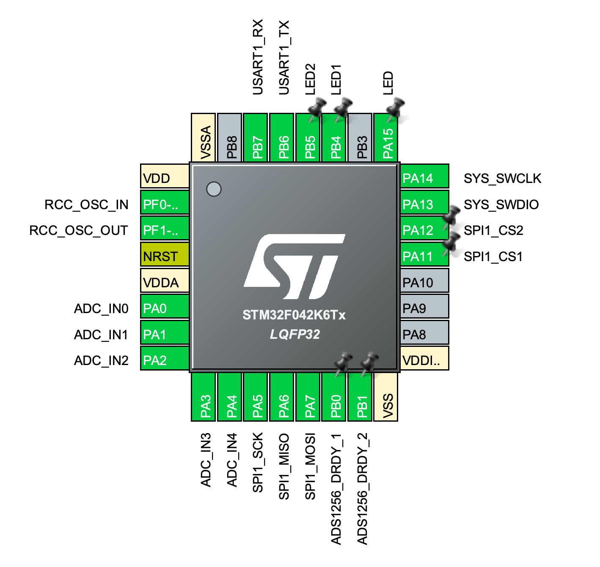

# DexUMI Embedded System
This folder contains all embedded system files for the DexUMI.

## 🔧 Installation

- For the **DexUMI Inspire Hand model**, download and flash the firmware:  
  [DexUMI_Inspire_Firmware.hex](assets/DexUMI_Inspire.hex)

- For the **DexUMI XHand model**, download and flash:  
  [DexUMI_XHand_Firmware.hex](assets/DexUMI_XHand.hex)

## 🧑‍💻 Notes for Advanced Developers

If you want to modify the firmware or check the pin configurations, open  
[`DexUMI.ioc`](DexUMI.ioc) using [STM32CubeMX](https://www.st.com/en/development-tools/stm32cubemx.html).

### Pin Allocation
  
Here’s the default pin configuration for DexUMI. You usually won’t need to change these settings.

### 📁 Source Code Structure
- [`/Core`](./Core/)  
  *Auto-generated by STM32CubeMX, except for the files below:*
  - [`main.c`](./Core/Src/main.c): System initialization and encoder data packaging.
  - [`stm32f0xx_it.c`](./Core/Src/stm32f0xx_it.c): Contains the SysTick handler for system-level scheduling.

- [`/Drivers`](./Drivers/)  
  STM32 HAL drivers (auto-generated).

- [`/Users`](./Users/)  
  Custom drivers and application code:
  - [`ads1256.c`](./Users/ads1256.c): ADC driver for the ADS1256 chip.
  - [`fsr.c`](./Users/fsr.c): Reads FSR voltage using STM32’s internal ADC.
  - [`delay.c`](./Users/delay.c): Implements precise millisecond-level delay.
